# Quera_G11-Project2
Cryptocurrency Data Analysis with Machine Learning (Clustering &amp; Prediction)

This repository is for the second internship project of [Quera Data Science Bootcamp](https://quera.org/college/bootcamp/data-science)

[Quera](https://quera.org/) Data Science Bootcamp has been held for 12 weeks from August to November 2023. in which we learned and practiced both technical and soft skills in order to become ready to work as data Scientists in the market and industry.

This repository is for the second teamwork internship project of this Bootcamp, which is about data analysis in the field of Cryptocurrency Market, performing Machine learning Clustering and prediction with visualization.

The following members are present in this team, arranged in alphabetical order:
- (Group 11)
* [**Mr. Abednezhad, Saleh (Team Head)**](https://github.com/mr-robot77)
* [Mr. Ghiyasi, Mahdi](https://github.com/mahdi-ghiyasi)
* [Mr. Khodadadi, Sina](https://github.com/SinaaKh)
* [Mr. Moosaei, Amirali](https://github.com/mo0o0o0os)

This team has completed the project under the mentoring of [**Mr. Jour Ebrahimian, Hossein**](https://github.com/H055EIN).

##  Introduction

Welcome to the documentation for our project that involves importing data into Jupyter Notebook, performing clustering and hierarchical clustering analysis on the collected data with k-means, dbscan, and dendrogram, getting predictions of the next day, and finally visualizing it. This project aims to provide valuable insights into cryptocurrency market data, enabling us to make informed decisions and gain a deeper understanding of market trends.

## Objectives

The primary objective of this project is to create a streamlined data pipeline for collecting, storing, analyzing, and visualizing cryptocurrency market data. By following this documentation, you will learn how to:

1. Clustering: analyzing data with k-means & dbscan and getting insights.

2. Hierarchical Clustering: analyzing data with dendrogram.

3. Prediction: prediction next direction of currency with different classification models, adding extra features and evaluating models, and also defining new solutions with this data.


Below is a file structure of this project:

```
    .
    ├── Problem 1    # clustering
    |    ├── Q1_data.csv
    |    ├── dbscan.ipynb
    |    └─  k-means.ipynb
    |   
    ├── Problem 2   # Hierarchical clustering
    |   ├── clustering.ipynb
    |   ├── coins_data.xlsx - Sheet1.csv
    |
    ├── Problem 3   # Prediction
    |   ├── Extra Features & New Solution.ipynb
    |   ├── prediction.ipynb
    |
    ├── images
    └── README.md # Explanation of project structure, tools used, and instructions for executing each part of the project.
```


--------------------------------------------------------------------------------------------------
### Problem 1: Clustering

##### Scatter plot of data

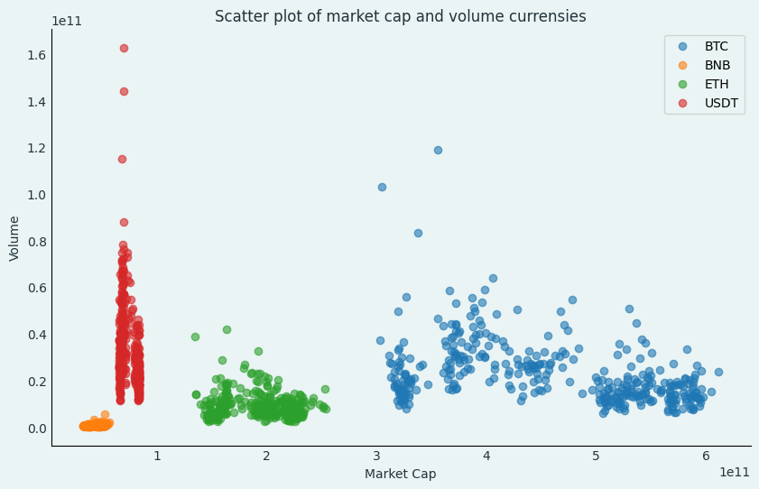

As we can see the Market Cap of all cryptocurrencies, except for Tether (because it is stablecoin and its market value does not change much), has significantly decreased from its high value. The decline in market value is particularly noticeable for Bitcoin, which has a larger market value compared to other cryptocurrencies. This decrease in Market Cap is attributed to the events that took place in November 2022, as mentioned in this link.

Due to Bitcoin's popularity and Tether's status as a well-known stablecoin, both currencies have a higher transaction Volume compared to other cryptocurrencies.

#### Section 1


#### Section 2
Prior to clustering, it is necessary to scale the data to ensure that the features have a similar impact.[ref] Typically, data is standardized before clustering, meaning that the average of all features is adjusted to zero and their standard deviation is set to one. In our case, we initially standardize the data, but we also evaluate the normalized state of the data.

##### Standardization:
Within-Cluster Sum of Square analysis

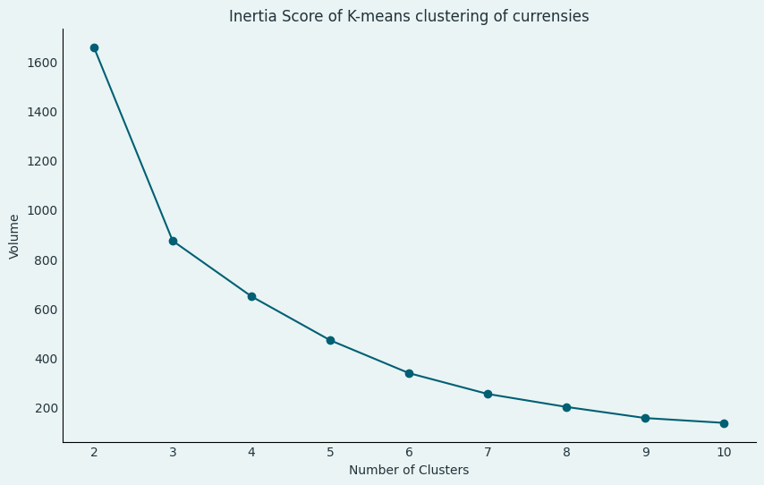

Upon observation, it is evident that there is no distinct elbow point that can be identified. Therefore, we need to employ alternative methods for determining the optimal number of clusters.

##### silhouette analysis
The Silhouette method is a technique used to determine the optimal number of clusters in a K-means clustering algorithm. It evaluates the quality of clustering by measuring how similar an object is to its own cluster compared to other clusters. The higher the silhouette score, the better the clustering quality.

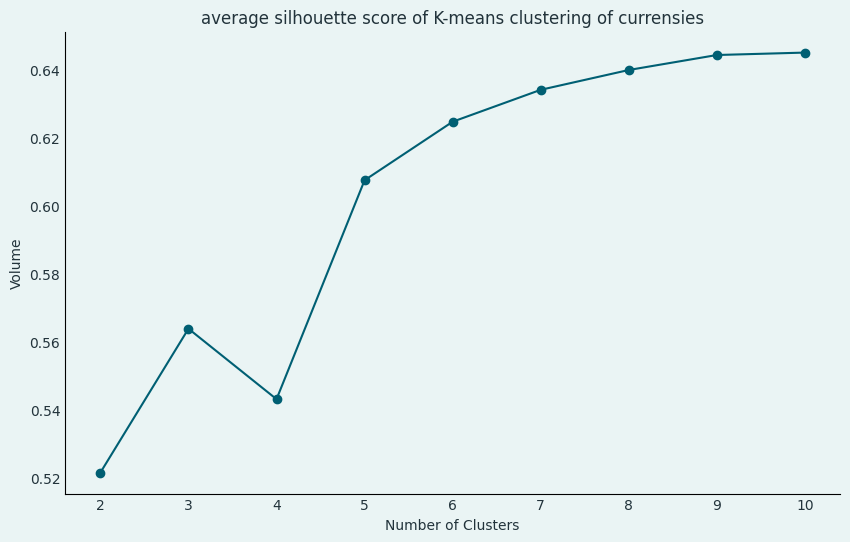

As observed, the silhouette score increases as the number of clusters increases. However, we are still unable to determine the exact number of clusters based on this criterion alone. In the subsequent analysis, we will delve deeper into the results obtained from the silhouette method.
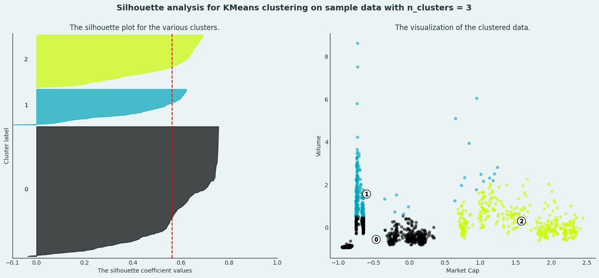
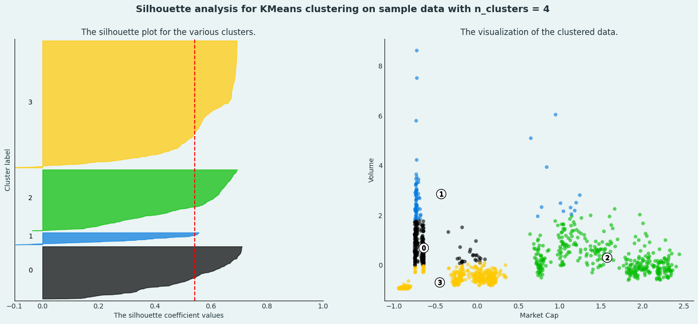
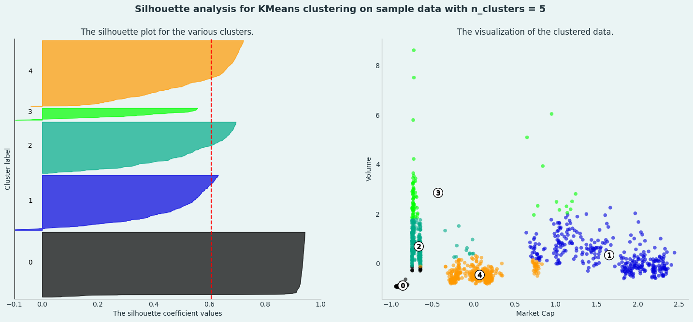
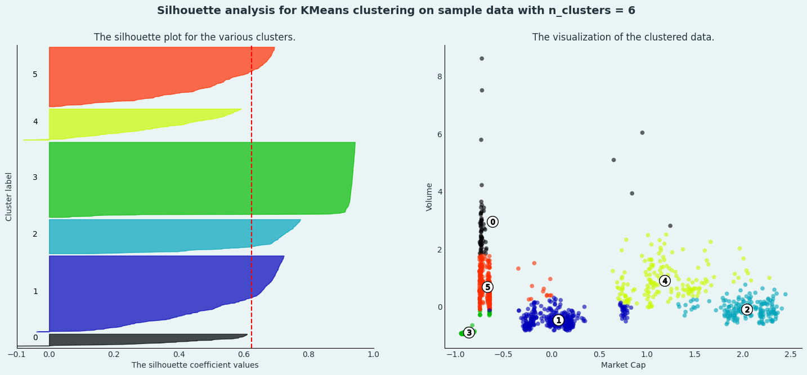

In the left-hand graphs, we can observe the silhouette scores for each clustering. Here, the y-axis represents individual data points, while the x-axis represents the silhouette score. The red line indicates the average silhouette score for the clustering. However, there are certain considerations to keep in mind when interpreting this chart.

- Firstly, a higher average silhouette score generally indicates better clustering. However, relying solely on this score is not sufficient for determining the optimal clustering solution.
- Secondly, the width of each cluster in the graph corresponds to the number of data points within that cluster. Therefore, it is important to aim for a clustering solution where the number of data points in each cluster is roughly equal.
- Thirdly, it is crucial that the silhouette scores for each individual cluster are good individually as well. It is preferable that the score for each cluster does not fall below the overall average. Otherwise, we risk having a cluster with data points that might actually belong to other clusters.

These considerations are important for making informed decisions regarding the selection of a suitable clustering solution.

#### Conclusion:
Based on the considerations mentioned earlier, it appears that the number of clusters 4 and 5 may be more suitable compared to other numbers of clusters. Both 4 and 5 clusters exhibit a good average silhouette score, and their issues are relatively fewer compared to other clustering solutions.

In the case of 4 clusters, one cluster stands out as significantly larger, suggesting that it may contain two clusters that are closely related. However, similar issues exist to some extent in other clusters as well.

On the other hand, when using 5 clusters, one cluster exhibits lower scores than the average, indicating that this particular cluster may not be well-defined. Nevertheless, this problem can also be observed in solutions with a higher number of clusters.

Considering these factors, it can be concluded that the number of clusters 4 or 5 appears to be more suitable for the given dataset.

#### Normalization:

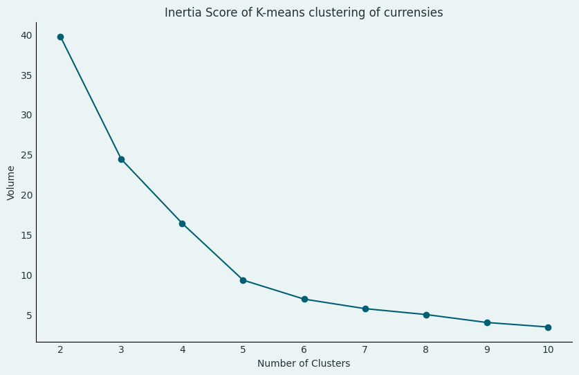
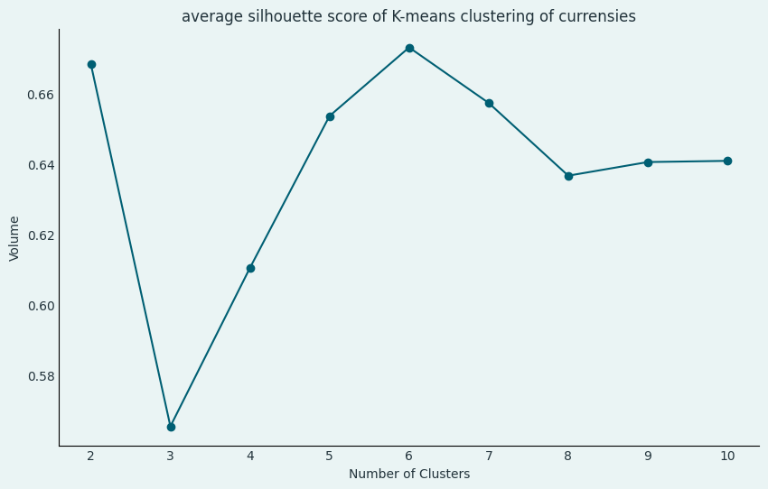

In the first diagram, there may not be a noticeable difference compared to the previous state. However, in the second diagram, we can observe that the silhouette score reaches its maximum value for the clustering with 6 clusters. However, it is important to note that the difference between the silhouette score of this clustering and the scores of other clusters is not significant.

Thus, we need to further investigate the results obtained from the silhouette method to make a well-informed decision.

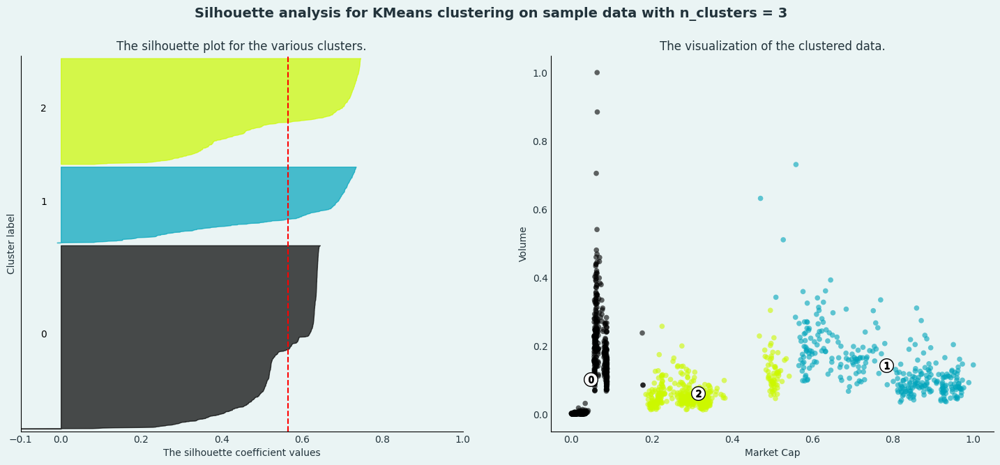
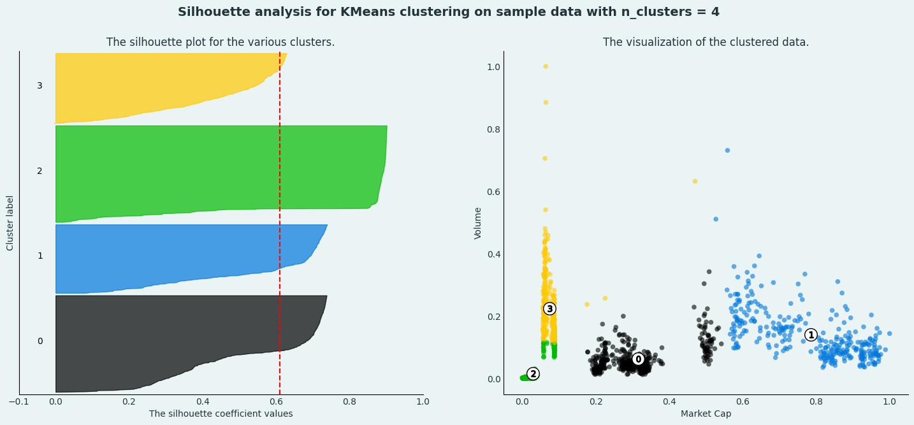
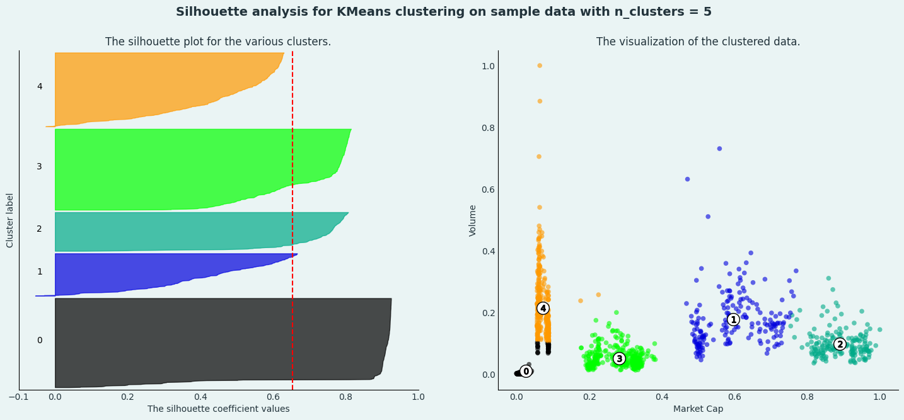

Based on the results obtained in this case, it can be concluded that clustering with 4 clusters is more suitable compared to other clusterings. This is because the average silhouette score for this clustering is not significantly different from the maximum score obtained.
Additionally, the number of data points assigned to each cluster is nearly equal, indicating a balanced distribution.
Moreover, the silhouette score for each cluster is not lower than the overall average score.

Therefore, considering these factors, clustering with 4 clusters appears to be the most appropriate choice.

#### DBSCAN
DBSCAN requires only two parameters: epsilon and min_pts. Epsilon is the radius of the circle to be created around each data point to check the density and min_pts is the minimum number of data points required inside that circle for that data point to be classified as a Core point.

Now we scale the dataframe and then use DBScan for different values of epsilon and minimum samples that we require to count the data as core point. in the end we found that best result is developed from choosing (min_pts = 15, eps = 0.25).

Now we are going to deeply check two things,
first of all what is the effect of changing epsilon for a fixed min_pts (here specially min_pts = 15)
then what is the effect of changing min_pts for a fixed epsilon value (here specially epsilon = 0.25)

.png)
.png)
.png)
.png)
.png)
.png)
.png)
.png)
.png)
.png)
.png)
.png)

#### Conclusion
with the charts above, we can see two obvious effects when min_pts and epsilon increases.
when epsilon increases, the radius increase, so the number of cluster usually decrease and the size of the cluster increases.
also when the min_pts increases, it will be harder for each point to join into a cluster and became core point. so usually the number of outliers increase.
and we figure out that the epsilon = 0.25 and min_pts = 15 is what we need for 5 meaningful clusters.

In this section, we retrieve the data from the file and incorporate the Genesis Year, which was extracted from this link, into the data frame.

------------------------------------------------------------------------------------------------
### Problem 2: Hierarchical Clustering

In this section, we retrieve the data from the file and incorporate the Genesis Year, which was extracted from this link, into the data frame.

#### Section 1


We have performed clustering using two characteristics: market cap and volume. As depicted in the dendrogram, currencies with similar market cap and volume were initially grouped together in one cluster. Subsequently, clusters that were in close proximity to each other were merged, resulting in higher-level clusters. Additionally, a general clustering pattern can be observed in this dendrogram, where Tether and Bitcoin are placed in one cluster, while the remaining currencies are grouped in another cluster due to Tether and Bitcoin significant differences in market cap and volume compared to other currencies.

Given Ethereum's standing as one of the leading currencies in the market, it was anticipated that it would be grouped alongside Bitcoin and Tether. However, the graphs presented in the first phase of the project revealed that Ethereum's volume is slightly lower than that of Bitcoin, while Bitcoin boasts a larger market cap than Ethereum. Conversely, Ethereum's market cap surpasses that of Tether, but its volume is significantly lower compared to Tether. As a result of these disparities, Ethereum is not included in the Bitcoin and Tether cluster.

#### Section 2
The issue at hand is that when encoding the categorical features, their distance from one another is greater than it should be. As a result, these features have a more significant impact on clustering. Although methods such as K-prototypes for clustering mixed data are outlined in this link, we specifically sought to utilize hierarchical clustering, which prevented us from leveraging these approaches. Consequently, we proceeded with the standard procedure.

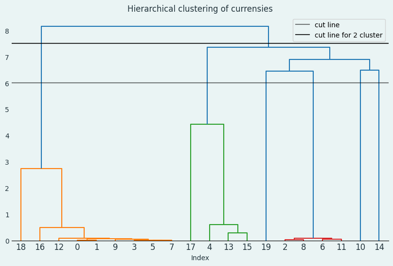

We have performed clustering using three features: market cap, volume, and proof type. As observed above, by cutting the dendrogram at the marked black line, we obtain distinct clusters based on proof type. Bitcoin stands out in a separate cluster due to its substantial differences in market cap and volume compared to other currencies. In the clusters below, currencies with similar market cap and volume are grouped together.

In the division into 2 clusters, it is evident that all the currencies with proof type "PoS" are grouped together in one cluster, while the remaining currencies are placed in the second cluster. In the subsequent branch clusters, currencies are further clustered based on their volume, market cap, and proof type. This indicates an improvement in the clustering process overall, as it takes into account multiple factors for grouping the currencies.

#### Section 3
##### adding Network

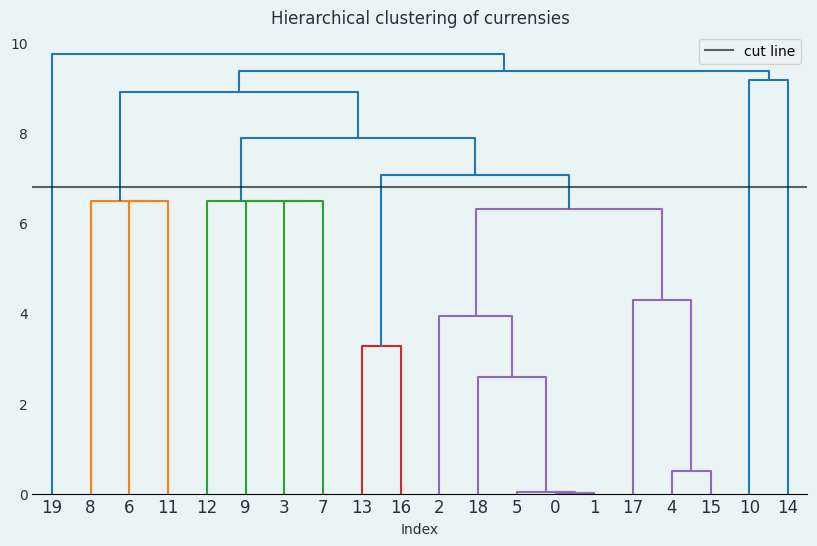

By incorporating network feature into the clustering analysis, we can observe an improved clustering solution. If we divide the dendrogram with the black line, we can identify well-defined clusters in terms of both network structure and proof type.

Furthermore, the influence of volume and market capitalization is also evident in this clustering.
For instance, Bitcoin is separated from other similar currencies due to its high volume and market capitalization. In the branch clusters, we can see that currencies are assigned to different clusters based on their difference in volume and market cap.

##### adding GenesisYear


With the addition of the "GenesisYear" feature, the dendrogram now exhibits a more meaningful structure, indicating that the currencies within each cluster are more similar to each other compared to the previous case. As anticipated, the inclusion of new features has provided additional information for clustering.

Moreover, it is noteworthy that the influence of the "volume" and "market cap" features has decreased compared to the initial case. This suggests that the clustering now takes into account not only these factors but also other features. Consequently, the resulting clusters are likely to reflect more comprehensive similarities and differences among the currencies.

----------------------------------------------------------------------------------
### Problem 3: Prediction
#### Method 1
##### Try models
##### Staking Models (KNN + Decision Tree)
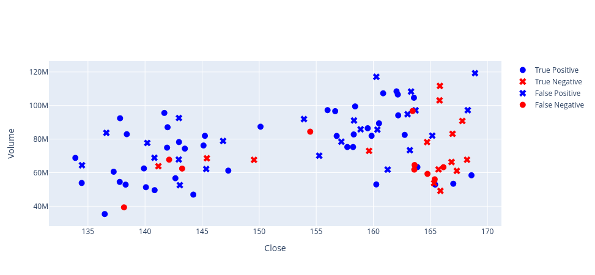
**************************************************
Model:  Stacking
***********************************
[[15 24]
 [10 43]]
{'AUC': 0.598,
 'Accuracy': 0.63,
 'F1 Score': 0.717,
 'MSE': 0.37,
 'Precision': 0.642,
 'Recall': 0.811}
_method1_on%20test.png)
**************************************************
Model:  Stacking
***********************************
[[9 3]
 [9 9]]
{'AUC': 0.625,
 'Accuracy': 0.6,
 'F1 Score': 0.6,
 'MSE': 0.4,
 'Precision': 0.75,
 'Recall': 0.5}
##### Evaluation

#### Method 2
##### Random Forest

**************************************************
Model:  Random Forest 16
***********************************
[[14 25]
 [13 40]]
{'AUC': 0.557,
 'Accuracy': 0.587,
 'F1 Score': 0.678,
 'MSE': 0.413,
 'Precision': 0.615,
 'Recall': 0.755}
__________________________________________________

**************************************************
Model:  Random Forest 16
***********************************
[[ 6  6]
 [ 3 15]]
{'AUC': 0.667,
 'Accuracy': 0.7,
 'F1 Score': 0.769,
 'MSE': 0.3,
 'Precision': 0.714,
 'Recall': 0.833}
__________________________________________________
##### Evaluation

#### Method 3
##### Logistic Regression

**************************************************
Model:  Logistic Regression
***********************************
[[21 25]
 [12 47]]
{'AUC': 0.627,
 'Accuracy': 0.648,
 'F1 Score': 0.718,
 'MSE': 0.352,
 'Precision': 0.653,
 'Recall': 0.797}
__________________________________________________

**************************************************
Model:  Logistic Regression
***********************************
[[ 1 11]
 [ 1 17]]
{'AUC': 0.514,
 'Accuracy': 0.6,
 'F1 Score': 0.739,
 'MSE': 0.4,
 'Precision': 0.607,
 'Recall': 0.944}
__________________________________________________
##### Evaluation


#### Presenting New Solution Design:
##### Moving average crossover strategy
in this section, we present a moving average crossover strategy which is a simple technical analysis strategy that uses two moving averages to identify trend changes. The strategy works by looking for the point at which the shorter moving average crosses above or below the longer moving average. the shorter moving average is the 44-day exponential moving average (EMA), and the longer moving average is the 252-day EMA. When the 44-day EMA crosses above the 252-day EMA, it is a signal that the market is entering a bullish trend. When the 44-day EMA crosses below the 252-day EMA, it is a signal that the market is entering a bearish trend.

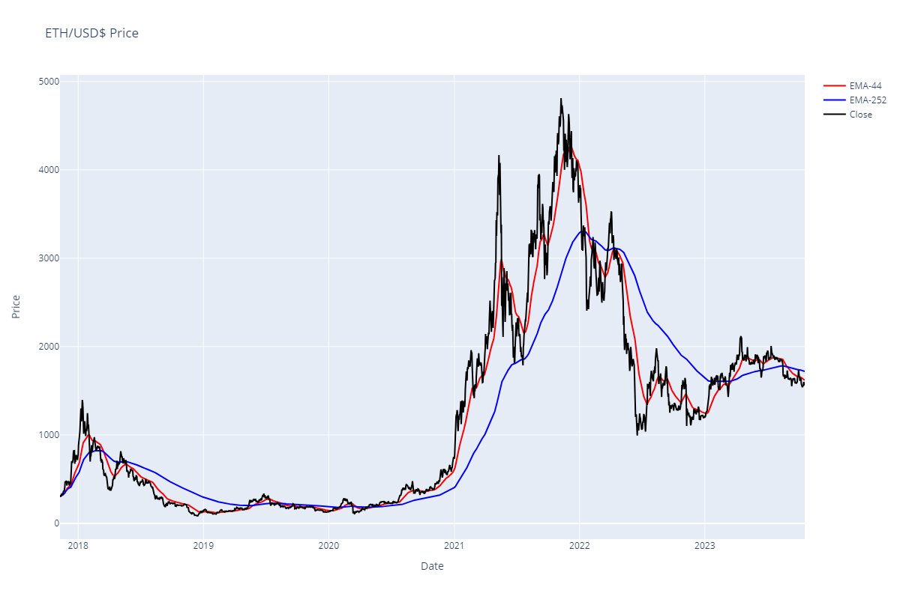

##### Generating trading signals with moving average crossover
The following example shows how to use the moving average crossover strategy to trade ETH/USD:
Here we want to implement a simple trading strategy based on the Exponential moving average (EMA) to generate trading signals. The strategy works as follows:

Two EMAs with time periods of 44 and 252 days are calculated. If the 44-day EMA is above the 252-day EMA, a long position is opened. If the 44-day EMA is below the 252-day EMA, a short position is opened. Output:

A plot of ETH price and the "Position" column is created.

###### Input variables:
df_eth: A DataFrame containing ETH price data

###### Output variables:
df_eth_filtered: A DataFrame containing ETH price data and the "Position" column

###### Generating trading signals
Once the moving averages have been calculated, we can use them to generate trading signals. The strategy works by looking for the point at which the 44-day EMA crosses above or below the 252-day EMA.

In this case, a value of 1 indicates a long position, and a value of -1 indicates a short position.


###### Strategy Performance:
This Section analyzes the performance of an EMA-based trading strategy applied to ETH/USD prices. It calculates the daily logarithmic returns of the closing prices and uses a specified 'Position' value to generate strategy returns.
Implementing two EMAs Crossover trading strategy Signals:
This code implements a trading strategy based on the comparison of two exponential moving averages (EMA-44 and EMA-252). It calculates the daily returns of ETH/USD prices and generates trading signals accordingly. The strategy returns and cumulative strategy returns are calculated and plotted. Additionally, the Sharpe Ratio is computed as a measure of risk-adjusted return.


###### in summary:

We define two trading signals:
- Buy: EMA-44 > EMA-252
- Sell: EMA-44 < EMA
- calculates the daily returns of the ETH/USD price
- calculates the returns of the trading strategy
- calculates the cumulative returns of the trading strategy
- plot the cumulative returns of the trading strategy
- calculates the Sharpe Ratio of the trading strategy

The Sharpe Ratio is a measure of the risk-adjusted performance of an investment. It is calculated by dividing the average return of the investment by its standard deviation.


-----------------------------------------------------------------------------------
